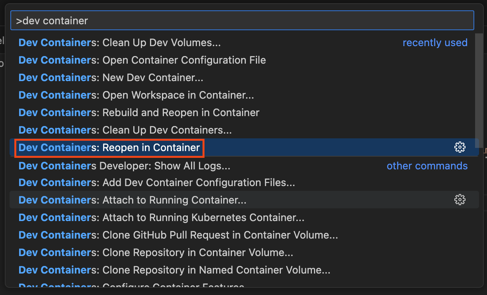

# Báo cáo LaTeX Data Engineer - Semester 214

Đây là nơi để mình tổng hợp tài liệu cho môn DE.

## Hướng dẫn cài đặt trên máy

Ở đây, mình sẽ sử dụng chính [devcontainer](https://containers.dev/) để làm việc vì cài đặt LaTeX
trên máy tương đối phức tạp. Mặc định, các bạn đã cài đặt:

- [Git](https://git-scm.com/book/en/v2/Getting-Started-Installing-Git)
- [Docker](https://docs.docker.com/engine/install/)

Sau khi đã cài đặt 2 công cụ trên, bạn clone project này về. Sau đó dùng VSCode để mở thư mục này.
Có 2 cách để bạn có thể đi vào devcontainer từ VSCode:

1. Bạn nhấn vào nút popup **"Reopen in Container"** ở góc phải dưới 
2. Bạn bật Command Palette (`Ctrl + Shift + P`), nhập và chọn: **"Dev Containers: Reopen in
   Container"**. 

> Bạn có thể đợi đến 10 phút để container được cài đặt

## Cài đặt extension cho LaTeX trên Visual Studio Code

Sau khi VSCode được cài đặt trong devcontainer, bạn sẽ nhìn thấy góc trái dưới màn hình, phần bôi
xanh dương nội dung **"Dev Container @ desktop-linux"**. Đây là cách VSCode dùng để phân biệt môi
trường đang được sử dụng. Trong phạm vi repo này, bạn chỉ cần phân biệt giữa môi trường local (sẽ
không có thông báo) và chạy trên container (có thông báo góc trái dưới).


## Chỉnh sửa nội dung

LaTeX là một ngôn ngữ vừa phải trong việc xây dựng cái báo cáo và luận văn. Mình sẽ đề cập đôi nét
những điểm mà các bạn nên lưu ý trong quá trình chỉnh sửa nội dung:

- Nếu các bạn muốn dùng dấu **"&"**, bắt buộc các bạn phải *escape* chúng bằng dấu "\", vì đây là ký
  tự đặc biệt trong LaTeX.
- Hiện tại, config của mình chỉ hỗ trợ gõ tiếng Anh. Mình vẫn đang nghiên cứu hỗ trợ tiếng Việt.

## Phân báo cáo thành các phân đoạn (sections)

Để tránh việc nội dung của file quá nhiều dẫn đến khó di chuyển trong thư mục, bạn có thể phân bài
báo cáo thành các phân đoạn (section, subsection, ...). Quy cách làm việc của mình đối với bước này
là:

1. Tạo 1 file mới để chứa section trong thư mục libraries
2. Trong thư mục `main.tex`, import file bằng cách dưới. Ở đây, ta gọi hàm import, với thư mục chứa
   files là `libraries` nằm trong dấu ngoặc nhọn thứ 1, và tên file cần import tại dấu ngoặc nhọn
   thứ 2. Lưu ý là ta không cần thêm extension `.tex` cho tên.

```latex
\import{libraries}{title_page}
```

## Cài đặt thư viện mới

Mình có cài đặt một lượng thư viện tối thiểu làm tiền đề. Trong một số trường hợp, bạn có thể cần
cài đặt thêm thư việc của LaTeX. Để đảm bảo tất cả được cài đặt, bạn cần:

1. Vào `.devcontainer/devcontainer.json`
2. Thêm vào mục `packages` như bên dưới, chỉ dùng dấu phẩy để tách tên thư viện.

```json
{
    "image": "mcr.microsoft.com/devcontainers/base:1.0-bookworm",
    "features": {
        "ghcr.io/prulloac/devcontainer-features/latex:1": {
            "packages": "datetime,fmtcount,xkeyval,<lib1>,<lib2>"
        }
    }
}
```

## Thêm trích dẫn (citation)

Ví dụ, mình muốn thêm trích dẫn Google BigQuery. Để thêm citation, mình sẽ kiếm BibTex format của
citation và dán vào thư mục `citation.bib`.

```tex
@inproceedings{Dremel,
  title  = {Dremel: A Decade of Interactive SQL Analysis at Web Scale},
  author = {...},
  year   = {2020},
  url    = {http://www.vldb.org/pvldb/vol13/p3461-melnik.pdf},
  pages  = {3461-3472}
}
```

Label `Dremel` ở đầu sẽ dùng để mình gọi trích dẫn. Trong bài, nếu mình cần trích dẫn, chỉ dùng
`\cite{Dremel}` để chỉ để BigQuery.

```latex
BigQuery is good \cite{Dremel}.
```

LaTeX sẽ hỗ trợ build, sắp xếp và tinh chỉnh citation theo cách này. Vì vậy, mình rất khuyến khích
các bạn sử dụng cách này để trích dẫn.

## Trở về thư mục gốc

Để trở về thư mục gốc, bạn Command Palette (`Ctrl + Shift + P`) và chọn **"Dev Containers: Reopen
Folder Locally"**

## Thao tác với Git

Ở đây, mình mặc định các bạn đã quen với các thao tác trên Git. Hiện tại, mình chưa biết cách càiđặt
Git trên Devcontainer, cảm phiền các bạn [quay về thư mục gốc](#trở-về-thư-mục-gốc) và sử dụng Git ở
đây.
